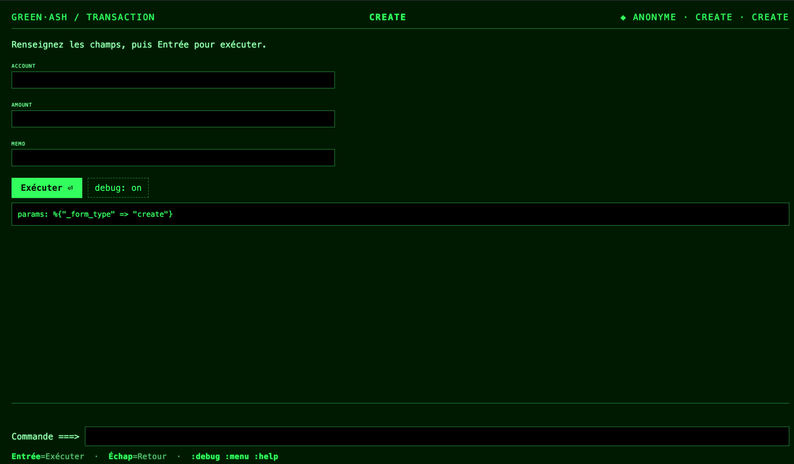
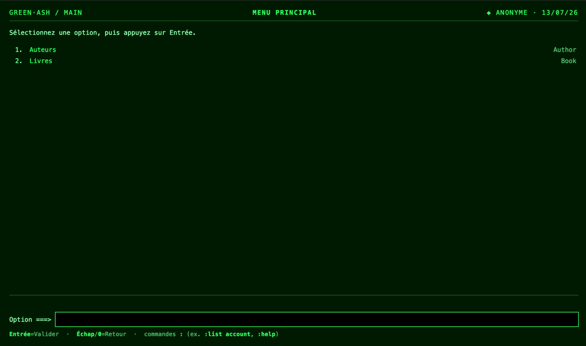

# GreenAsh — monorepo

A keyboard-driven, green-screen LiveView console — reminiscent of AS/400-style
terminal screens — generated by **introspection** from your Ash resources.
Zero UI code.

```
.
├── green_ash/        # the library (package :green_ash), no coupling to the host app
├── examples/
│   ├── bank/         # demo (Account/Transaction, policies, actor, filters)
│   └── library/      # fresh-bootstrap demo (Author/Book) + installer run for real
├── docker/verify/    # 3-layer pre-publish verification (see below)
└── .github/          # CI: the library across three Elixir/OTP pairs, both examples
```

## The library — `green_ash/`

One-command install (discovers your Ash domains, patches your router):

```bash
mix igniter.install green_ash
```

Or manually — add the dependency and mount the macro in your router, behind a
dev-only guard (the console has no access control of its own):

```elixir
if Application.compile_env(:my_app, :dev_routes) do
  import GreenAsh.Router

  scope "/" do
    pipe_through :browser
    green_ash "/cli"
  end
end
```

See [`green_ash/README.md`](green_ash/README.md) for details, and
[`green_ash/CHANGELOG.md`](green_ash/CHANGELOG.md) for what changed in each
release. Both live in that subdirectory rather than at the root because that is
where the published package lives — it is the copy Hex and HexDocs serve.

Any Ash resource declared in an exposed domain then shows up in `/cli`:

- **Menu** → **lists** (filter, sort, pagination, choose your columns with
  `:cols`) → **create / business-action update / confirmed destroy** →
  **record inspection**.
- **Actor** (`:actor <resource> <id>`) to run everything as a given record and
  watch your policies decide — a refusal is reported, not crashed on.
- **Tenant** (`:tenant <value>`) to browse multitenant resources; without one
  they are explicitly refused rather than opened wrong.
- **Relationship pickers**: a `belongs_to` offers the related records instead
  of asking you to paste a UUID.
- **Shareable screens**: a list's filter, sort, columns and page live in the
  URL, so it can be bookmarked or sent to a colleague.
- **Vim-style commands** throughout.

**Zero UI code.**

- Decoupled: its own components, paths relative to the mount point, domains
  read dynamically at runtime — no dependency on the host's components/routes.
- Tested against the **ETS** data layer (no Postgres required): `cd green_ash && mix test`.
  The examples cover what only a real data layer can (`AshPostgres`).

## The example — `examples/bank/`

Phoenix 1.8 + Ash 3 + AshPostgres app (Postgres via Docker, port 4200) that
depends on the library via `path:` and mounts it under `/cli` (`/` redirects
there in dev).

```bash
cd examples/bank
mix deps.get
mix ash.setup          # creates bank_dev + migrations
mix phx.server         # http://localhost:4200
mix test               # integration tests through the mounted console
```

The demo resource `Bank.Ledger.Account` (`lib/bank/ledger/account.ex`)
illustrates good practices: `description` on the resource/actions, a business
action with an argument (`open`/`credit`), a filterable read (`search`), a
`destroy` policy gated to an actor. `Bank.Ledger.Transaction`
(`belongs_to :account`) exercises foreign-key rendering.

## The example — `examples/library/`

App bootstrapped **from scratch** (never previously exposed to `green_ash`
before `mix green_ash.install` ran): domain `Library.Catalog` with `Author`
(`has_many :books`) and `Book` (`belongs_to :author`) — a second relationship,
tested on a different resource shape. Serves as a dress rehearsal for the
installer before publishing to Hex.

```bash
cd examples/library
mix deps.get
mix ash.setup          # creates library_dev + migrations
mix phx.server          # http://localhost:4201  (distinct from bank's 4200)
mix test
```

## Continuous integration — `.github/workflows/ci.yml`

On every push: the library across `1.15-otp-25`, `1.17-otp-26` and
`1.19-otp-28`, and both examples against Postgres. Fast, so it stays useful.

## Pre-publish verification — `docker/verify/`

Deeper than CI, and run by hand before a Hex release. Three Docker-based
layers:

```bash
./docker/verify.sh
```

1. **Clean-room compile/test** — fresh Hex/Mix state, matrix of Elixir/OTP
   versions bracketing the declared support range.
2. **Faithful install rehearsal** — a container with real Postgres, a Phoenix
   + Ash app bootstrapped from absolute zero, then the actual
   `mix igniter.install` flow. Catches issues no local dev machine would ever
   see (already-installed archives, cached deps, etc.).
3. Same matrix layer, run across versions — see `docker/verify/`.

## Screenshots


